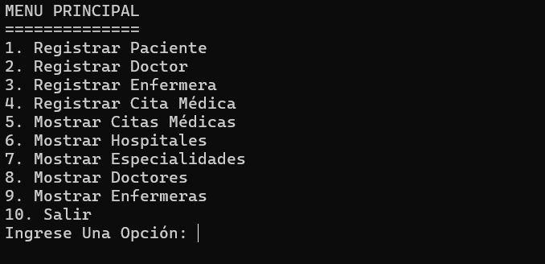
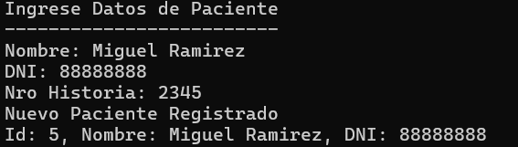
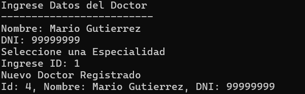
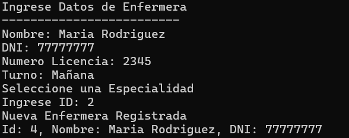
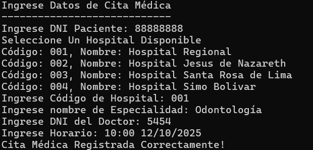
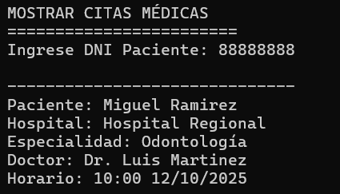
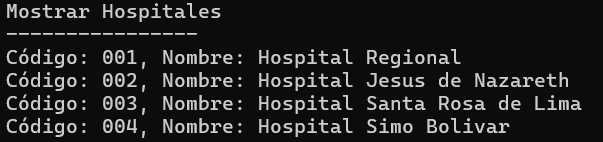
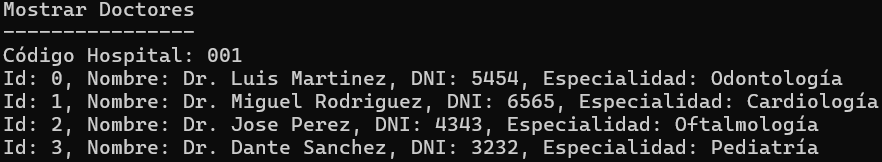
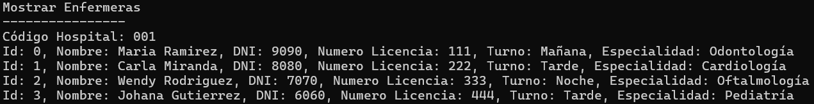

# 🏥 Sistema de Gestión de Hospitales
Este es un sistema de gestión para hospitales desarrollado en C#. 
Permite gestionar la información de pacientes, doctores, enfermeras, especialidades médicas, hospitales y citas médicas. 
A través de un menú interactivo en consola, los usuarios pueden realizar diversas acciones como registrar pacientes, doctores y enfermeras, crear citas médicas, y consultar información relacionada con los hospitales y sus servicios.

## Características

- **✅ Registro de Pacientes:** El sistema permite registrar nuevos pacientes con su nombre, DNI y número de historia clínica.
- **✅ Registro de Doctores:** El sistema permite registrar doctores con su especialidad médica.
- **✅ Registro de Enfermeras:** El sistema permite registrar enfermeras con su número de licencia, turno y especialidad asignada.
- **✅ Citas Médicas:** Los pacientes pueden agendar citas médicas con doctores en los hospitales disponibles, con especialidades específicas.
- **✅ Consultas de Información:** Los usuarios pueden consultar información sobre hospitales, especialidades médicas, doctores, enfermeras y citas médicas.

---

## 📘 Manual de Usuario

### Menú Principal

Al ejecutar el programa, el usuario verá el siguiente menú con opciones interactivas:



### Opciones del Menú

1. **👨‍🦽 Registrar Paciente**
    - El sistema pedirá al usuario ingresar los datos del paciente: nombre, DNI y número de historia.
    - El paciente será agregado al sistema y se mostrará una notificación con los datos ingresados.

        

2. **🧑‍⚕️ Registrar Doctor**
    - El sistema pedirá ingresar los datos del doctor: nombre, DNI y especialidad.
    - El doctor será agregado al sistema y se mostrará una notificación con los datos ingresados.

        

3. **👩‍⚕️ Registrar Enfermera**
    - El sistema pedirá ingresar los datos de la enfermera: nombre, DNI, número de licencia, turno y especialidad.
    - La enfermera será agregada al sistema y se mostrará una notificación con los datos ingresados.

        

4. **📅 Registrar Cita Médica**
    - El sistema pedirá al usuario ingresar el DNI del paciente.
    - Luego, solicitará el hospital, especialidad y doctor para agendar la cita médica.
    - El usuario podrá seleccionar el hospital y especialidad, y luego elegir un doctor disponible.
    - La cita será registrada correctamente y el sistema lo notificará.

        

5. **📋 Mostrar Citas Médicas**
    - El sistema pedirá al usuario ingresar el DNI del paciente y luego mostrará las citas médicas registradas para ese paciente.
    - Si no se encuentran citas para el paciente, se notificará que no existen citas registradas.

        

6. **🏥 Mostrar Hospitales**
    - El sistema mostrará la lista de hospitales registrados en el sistema.

        

7. **🩺 Mostrar Especialidades**
    - El sistema pedirá el código de un hospital y luego mostrará las especialidades disponibles en ese hospital.

        

8. **🧑‍⚕️ Mostrar Doctores**
    - El sistema pedirá el código de un hospital y luego mostrará la lista de doctores disponibles en ese hospital.

        

9. **👩‍⚕️ Mostrar Enfermeras**
    - El sistema pedirá el código de un hospital y luego mostrará la lista de enfermeras disponibles en ese hospital.

        

10. **🚪 Salir**
    - Saldrá del sistema.

---

## 🛠️ Requisitos

- **⌨️ Lenguaje**: C#
- **🖥️ Entorno de Desarrollo**: Visual Studio o cualquier otro entorno compatible con C#.
- **⚙️ .NET Framework**: .NET Core o .NET Framework (según la versión utilizada).
- **💻 Sistema Operativo**: Windows, Linux o macOS (si está configurado para ejecutar aplicaciones .NET).

---

## 💻 Instalación

1. Puedes descargar el Proyecto desde el Repositorio de GitHub:

    ```bash
    git clone https://github.com/wildtest/Ejercicio02.git
    ```

2. Abre el proyecto en Visual Studio o el entorno de tu preferencia.

3. Compila y ejecuta el proyecto.

---
